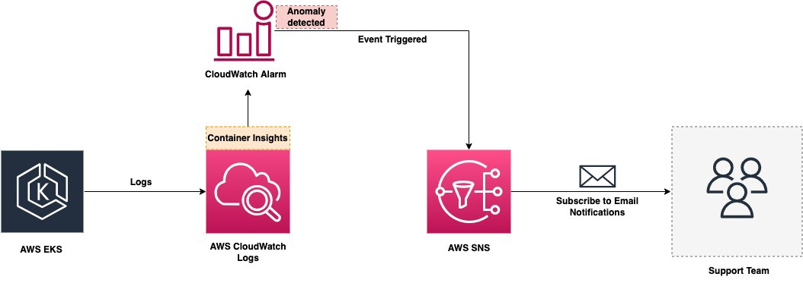
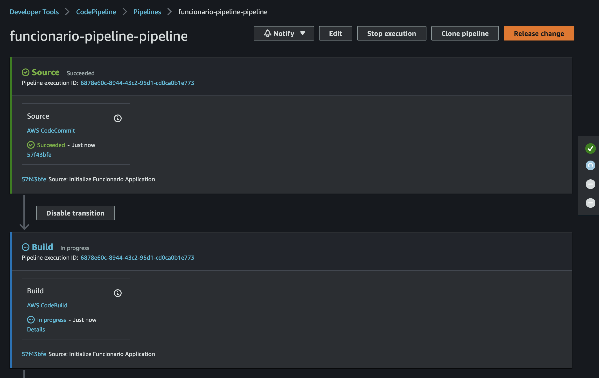
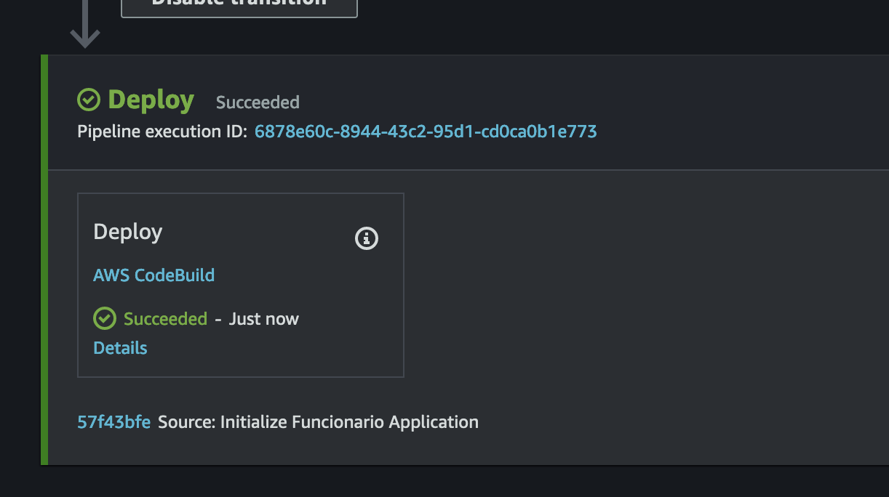
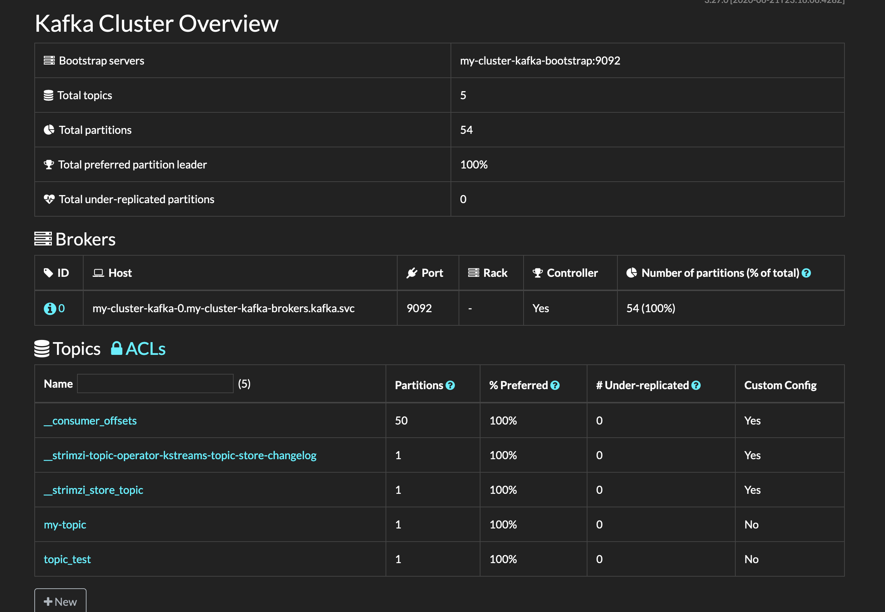

# Challenge Funcionario
## Description
You belong to a team whose main goal is to deploy a publicly accessible web application known as Funcionario to an AWS EKS cluster.

## General Architecture Diagram


## Observability Architecture Diagram


#### Observability Explication

Regarding observability is very important to consider different factors when you're working with streaming architecture. First to determine if our architecture is healthy we need to define what metrics and information we will monitoring and what are the most important pillars, the following pillars are very important to consider:

- Latency: determinate if the requests are taking more time that we estimated
- Traffic: queries that we receive by second
- Errors: if we have errors in the consume of the message or publish the message
- Saturation: related to performance resources like CPU, Memory, Disk Space and more.


## Requirements **IMPORTANT!!**
- Before start, We need review some requirements for the project can run without issues, based on the above please check the following list:

  - Identify AWS Account ID
  - Identify ARN Admin Role that we will use to run our scripts in Terraform
  - Identify VPC ID, Subnets IDs (Only Private), CIDR of our Private Subnets, Route Table ID of our Private Subnets
  - IAM Role with Admin Access (IAM Role for running our Terraform)
  - Create EC2 with Admin Role to run terraform and validate that you have connection with VPC and Subnets where your EKS Cluster will run
  - kubectl installed in your ec2 machine or environment where you're running terraform

## Least Privileges

If we need to use this code for production environment, I suggest following this list IAM Policies for create EKS Cluster with least privileges.

[Least Privileges EKS Blueprints for Terraform - Link](https://aws-ia.github.io/terraform-aws-eks-blueprints/v4.25.0/iam/minimum-iam-policy/)

## Getting Started

The easiest way to get started with this challenge is follow the following steps:

#### 1) Create Repositories - Funcionario and IaC

```terraform
aws codecommit create-repository --repository-name Funcionario --repository-description "Funcionario App" 
aws codecommit create-repository --repository-name IaC --repository-description "Infrastructure as Code" 
```

#### 2) Clone Repositories

```terraform
git clone codecommit://Funcionario Funcionario

git clone codecommit://IaC IaC
```

#### 3) Create S3 bucket to save our terraform state

**NOTA**: Remember use unique s3 bucket name.

```terraform
aws s3api create-bucket --bucket terraform-iac-state-v1 --region us-east-1
```

#### 4) Create SSM Parameters to use in our Codepipeline

```terraform
aws ssm put-parameter --name "account_id" --value "your-account-number" --type String 

aws ssm put-parameter --name "eks_cluster" --value "funcionario-eks" --type String 

aws ssm put-parameter --name "image_tag" --value "latest" --type String 
```
#### 5) Configure backend.tf, locals.tf and terraform.tfvars for specify own configuration

#### 6) Run Terraform in the following order:
```bash

1) cd IaC
2) cp -r ../funcionario/infrastructure-as-code/* .
3) cd test
4) terraform init
5) terraform plan
6) terraform validate
7) terraform apply -target=module.eks_cluster_role 
8) terraform apply -target=module.eks_node_role
9) terraform apply -target=module.eks_vpc_endpoints
10) terraform apply -target=module.eks_cluster

Estimated time of module.eks_cluster 16m
module.eks_cluster.module.eks_blueprints_kubernetes_addons.module.aws_vpc_cni[0].aws_eks_addon.vpc_cni: Still creating... [15m31s elapsed]
module.eks_cluster.module.eks_blueprints_kubernetes_addons.module.aws_vpc_cni[0].aws_eks_addon.vpc_cni: Still creating... [15m41s elapsed]
module.eks_cluster.module.eks_blueprints_kubernetes_addons.module.aws_vpc_cni[0].aws_eks_addon.vpc_cni: Creation complete after 15m49s [id=funcionario-eks:vpc-cni]
Apply complete! Resources: 51 added, 0 changed, 0 destroyed.

11) terraform apply -target=module.codepipeline
12) terraform apply -target=module.consumer
13) terraform apply -target=module.publisher
```

#### 7) Authentication to the EKS Cluster
```terraform
aws eks --region us-east-1 update-kubeconfig --name funcionario-eks
```

#### 8) Deploy Kafka
```terraform
kubectl create namespace kafka

kubectl create -f 'https://strimzi.io/install/latest?namespace=kafka' -n kafka

kubectl get pod -n kafka --watch

kubectl logs deployment/strimzi-cluster-operator -n kafka -f

kubectl apply -f https://strimzi.io/examples/latest/kafka/kafka-persistent-single.yaml -n kafka 

kubectl wait kafka/my-cluster --for=condition=Ready --timeout=300s -n kafka 

```
#### 9) Test Kafka
```terraform
kubectl -n kafka run kafka-producer -ti --image=quay.io/strimzi/kafka:0.33.2-kafka-3.4.0 --rm=true --restart=Never -- bin/kafka-console-producer.sh --bootstrap-server my-cluster-kafka-bootstrap:9092 --topic my-topic

kubectl -n kafka run kafka-consumer -ti --image=quay.io/strimzi/kafka:0.33.2-kafka-3.4.0 --rm=true --restart=Never -- bin/kafka-console-consumer.sh --bootstrap-server my-cluster-kafka-bootstrap:9092 --topic my-topic --from-beginning

Results:
Admin:~ $ kubectl -n kafka run kafka-producer -ti --image=quay.io/strimzi/kafka:0.33.2-kafka-3.4.0 --rm=true --restart=Never -- bin/kafka-console-producer.sh --bootstrap-server my-cluster-kafka-bootstrap:9092 --topic my-topic
If you don't see a command prompt, try pressing enter.
>Hola a todos
[2023-02-28 22:54:13,383] WARN [Producer clientId=console-producer] Error while fetching metadata with correlation id 4 : {my-topic=LEADER_NOT_AVAILABLE} (org.apache.kafka.clients.NetworkClient)
>^C^CAdmin:~ $ ^C
Admin:~ $ kubectl -n kafka run kafka-consumer -ti --image=quay.io/strimzi/kafka:0.33.2-kafka-3.4.0 --rm=true --restart=Never -- bin/kafka-console-consumer.sh --bootstrap-server my-cluster-kafka-bootstrap:9092 --topic my-topic --from-beginning
If you don't see a command prompt, try pressing enter.
Hola a todos

```

#### 10) After creation of infrastructure resources, We will prepare Funcionario application.
**Application Structure Folders:**
- *k8s/* for Kubernetes Resources <--- Important change the AWS Account Number on the manifests
- *consumer/* for consumer application
- *publisher/* for publisher application
- *buildspec-build.yml* Codebuild - Build Step
- *buildspec-deploy.yml* Codebuild - Deploy Step

```bash

1) cd ../../Funcionario
2) cp -r ../funcionario/funcionario-app/* .
3) git add .
4) git commit -m "Initialize Funcionario Application"
5) git push origin master
```

#### 11) Check Codepipeline 



#### 12) On EKS Cluster run the following commands to access the services:
```terraform
Admin:~ $ kubectl get services -o wide -n kafka
NAME                          TYPE           CLUSTER-IP       EXTERNAL-IP                                                               PORT(S)                               AGE    SELECTOR
consumer                      LoadBalancer   172.20.161.6     acbef0f6decb44be592e04c881f1cfc1-1900647330.us-east-1.elb.amazonaws.com   80:31331/TCP                          4m7s   app=consumer
kafdrop                       LoadBalancer   172.20.184.81    a9c8beb6b32474513a59443156247922-457613855.us-east-1.elb.amazonaws.com    80:31846/TCP                          4m6s   app=kafdrop
my-cluster-kafka-bootstrap    ClusterIP      172.20.245.217   <none>                                                                    9091/TCP,9092/TCP,9093/TCP            15m    strimzi.io/cluster=my-cluster,strimzi.io/kind=Kafka,strimzi.io/name=my-cluster-kafka
my-cluster-kafka-brokers      ClusterIP      None             <none>                                                                    9090/TCP,9091/TCP,9092/TCP,9093/TCP   15m    strimzi.io/cluster=my-cluster,strimzi.io/kind=Kafka,strimzi.io/name=my-cluster-kafka
my-cluster-zookeeper-client   ClusterIP      172.20.117.121   <none>                                                                    2181/TCP                              16m    strimzi.io/cluster=my-cluster,strimzi.io/kind=Kafka,strimzi.io/name=my-cluster-zookeeper
my-cluster-zookeeper-nodes    ClusterIP      None             <none>                                                                    2181/TCP,2888/TCP,3888/TCP            16m    strimzi.io/cluster=my-cluster,strimzi.io/kind=Kafka,strimzi.io/name=my-cluster-zookeeper
publisher                     LoadBalancer   172.20.130.103   a2f8501636423484d86371b7131454d4-162896705.us-east-1.elb.amazonaws.com    80:32681/TCP                          4m8s   app=publisher

Admin:~ $ kubectl get pods -n kafka
NAME                                         READY   STATUS    RESTARTS   AGE
consumer-8579d798c7-pqh59                    1/1     Running   0          55s
kafdrop-57c9979756-zvzzc                     1/1     Running   0          3m39s
my-cluster-entity-operator-cd9cb8986-sz6gq   3/3     Running   0          14m
my-cluster-kafka-0                           1/1     Running   0          15m
my-cluster-zookeeper-0                       1/1     Running   0          16m
publisher-544b7f959d-5z8jl                   1/1     Running   0          55s
strimzi-cluster-operator-6977966d6d-zk4pg    1/1     Running   0          17m

```
#### 13) Check Application
```bash
Running in your browser: http://a9c8beb6b32474513a59443156247922-457613855.us-east-1.elb.amazonaws.com/
```



# Clean Up
```terraform
NOTE: please delete the ECR Image Manually (this feature is coming soon)

1) terraform destroy
2) aws ssm delete-parameter --name "account_id" 
3) aws ssm delete-parameter --name "eks_cluster" 
4) aws ssm delete-parameter --name "image_tag" 
5) aws codecommit delete-repository --repository-name Funcionario
6) aws codecommit delete-repository --repository-name IaC
7) aws s3 rb s3://terraform-iac-state-v1 --force  
```

<!-- BEGIN_TF_DOCS -->
## Supported Features IaC
* EKS Cluster Private
* VPC Endpoints
* IAM EKS Cluster Role
* IAM EKS Node Role
* Add-ons
    * VPC CNI
    * CoreDNS
    * Kube Proxy
    * EBS CSI Driver
    * Cloudwatch Container Insights
    * AWS LoadBalancer Controller

## Terraform Inputs - env/terraform.tfvars

| Name                                                         | Description |
| -------------------------------------------------------------| ---------   |
| <a name="input_tags"></a> [tags](#input\tags)                | Tags for identify resources    |
| <a name="input_map_roles"></a> [map_roles](#input\map_roles) | Roles for access to EKS Cluster in aws-auth    |
| <a name="input_cluster_security_group_additional_rules"></a> [cluster_security_group_additional_rules](#input\cluster_security_group_additional_rules) | Cluster Security Group Rules for EKS Private Cluster    |
| <a name="input_node_security_group_additional_rules"></a> [node_security_group_additional_rules](#input\node_security_group_additional_rules) | Node Security Group Rules for EKS Private Cluster    |
| <a name="input_node_groups"></a> [node_groups](#input\node_groups) | Node Group Resources Definition |
| <a name="input_azs"></a> [azs](#input\azs) | Availability Zone for Node Groups - Note Important the order of this list is directly related with the order of private_subnets and private_subnets_cidr_blocks, please if you specific first AZ = us-east-1a the private_subnets and private_subnets_cidr_blocks must be AZ = us-east-1a too|
| <a name="input_vpc_id"></a> [vpc_id](#input\vpc_id) | VPC ID of Networking|
| <a name="input_private_subnets"></a> [private_subnets](#input\private_subnets) | Subnets IDs|
| <a name="input_private_subnets_cidr_blocks"></a> [private_subnets_cidr_blocks](#input\private_subnets_cidr_blocks) | CIDR Private Subnets|
| <a name="input_private_route_table_ids"></a> [private_route_table_ids](#input\private_route_table_ids) | Route Table IDs for our Private Subnets, We will use this parameter to enable our vpc_endpoints to enable the communication between our private cluster and aws service|
| <a name="input_repository"></a> [repository](#input\repository) | Repository Name for Funcionario Application|
| <a name="input_repository_branch"></a> [repository_branch](#input\repository_branch) | Repository Branch for define the trigger on Codepipeline|
| <a name="input_codebuild_configuration"></a> [codebuild_configuration](#input\codebuild_configuration) | Codebuild Environment Configuration|
| <a name="input_repository_read_write_access_arns"></a> [repository_read_write_access_arns](#input\repository_read_write_access_arns) | IAM Role ARN for read and write on ECR Funcionario|

## Terraform Inputs - locals.tf

| Name                                                                 | Description   |
| ---------------------------------------------------------------------- | --------- |
| <a name="input_name_prefix"></a> [name_prefix](#input\name_prefix) | Prefix Name that We will use for create everything on our project|
| <a name="input_region"></a> [region](#input\region) | Region Default|
| <a name="input_cluster_version"></a> [cluster_version](#input\cluster_version) | EKS Version - Default is 1.24|
| <a name="input_cluster_log_type"></a> [cluster_log_type](#input\cluster_log_type) | Cluster Logs Type for Kubernetes Observability|
| <a name="input_log_group_retention_in_days"></a> [log_group_retention_in_days](#input\log_group_retention_in_days) | Logs Retention Days|
| <a name="input_create_iam_role"></a> [create_iam_role](#input\create_iam_role) | This parameter disable to the module for create Cluster IAM Role, because the idea is that we can control those permissions|
| <a name="input_enable_cluster_encryption"></a> [enable_cluster_encryption](#input\enable_cluster_encryption) | This parameter enable the encryption on EKS Cluster for secrets|
| <a name="input_cluster_endpoint_public_access"></a> [cluster_endpoint_public_access](#input\cluster_endpoint_public_access) | This parameter enable the public access for our EKS Cluster|
| <a name="input_cluster_endpoint_private_access"></a> [cluster_endpoint_private_access](#input\cluster_endpoint_private_access) | This parameter enable the private access for our EKS Cluster|
| <a name="input_secrets_store_csi_driver"></a> [secrets_store_csi_driver](#input\secrets_store_csi_driver) | Secrets Store CSI Driver for Kubernetes secrets - Integrates secrets stores with Kubernetes via a Container Storage Interface (CSI) volume.|
| <a name="input_secrets_store_csi_driver_provider_aws"></a> [secrets_store_csi_driver_provider_aws](#input\secrets_store_csi_driver_provider_aws) | Secrets Store CSI Driver for Kubernetes secrets - Integrates secrets stores with Kubernetes via a Container Storage Interface (CSI) volume by AWS .|
| <a name="input_strimzi_kafka_operator"></a> [strimzi_kafka_operator](#input\strimzi_kafka_operator) | Strimzi provides a way to run an Apache Kafka cluster on Kubernetes in various deployment configurations - this integration is in testing phase|
| <a name="input_amazon_eks_vpc_cni"></a> [amazon_eks_vpc_cni](#input\amazon_eks_vpc_cni) | The Amazon VPC CNI plugin for Kubernetes add-on is deployed on each Amazon EC2 node in your Amazon EKS cluster. The add-on creates elastic network interfaces and attaches them to your Amazon EC2 nodes. The add-on also assigns a private IPv4 or IPv6 address from your VPC to each pod and service. |
| <a name="input_amazon_eks_coredns"></a> [amazon_eks_coredns](#input\amazon_eks_coredns) | CoreDNS is a flexible, extensible DNS server that can serve as the Kubernetes cluster DNS. |
| <a name="input_amazon_eks_kube_proxy"></a> [amazon_eks_kube_proxy](#input\amazon_eks_kube_proxy) | the kube-proxy add-on is deployed on each Amazon EC2 node in your Amazon EKS cluster. |
| <a name="input_amazon_eks_aws_ebs_csi_driver"></a> [amazon_eks_aws_ebs_csi_driver](#input\amazon_eks_aws_ebs_csi_driver) | The Amazon Elastic Block Store (Amazon EBS) Container Storage Interface (CSI) driver allows Amazon Elastic Kubernetes Service (Amazon EKS) clusters to manage the lifecycle of Amazon EBS volumes for persistent volumes. |
| <a name="input_coredns_cluster_proportional_autoscaler"></a> [coredns_cluster_proportional_autoscaler](#input\coredns_cluster_proportional_autoscaler) | Autoscaling of the DNS service in your Kubernetes cluster. |
| <a name="input_aws_load_balancer_controller"></a> [aws_load_balancer_controller](#input\aws_load_balancer_controller) | The AWS Load Balancer Controller manages AWS Elastic Load Balancers for a Kubernetes cluster. |
| <a name="input_aws_cloudwatch_metrics"></a> [aws_cloudwatch_metrics](#input\aws_cloudwatch_metrics) | Use CloudWatch Container Insights to collect, aggregate, and summarize metrics and logs from your containerized applications and microservices. |

## Improvements for the future
- IaC Pipeline
- Kafka Alternatives solutions like MSK or SQS
- Alerts on Cloudwatch Container Insights
- IPs Optimization on EKS
- Basic Auth for ELBs
- Module Support RDS

## Reference Links

- https://github.com/FernandoBLima/python-kafka-docker
- https://strimzi.io/quickstarts/
- https://medium.com/@adrianarba/ci-cd-defined-through-terraform-using-aws-codepipeline-aws-codecommit-and-aws-codebuild-12ade4d9cfa3
- https://aws.amazon.com/es/msk/
- https://docs.aws.amazon.com/codebuild/latest/userguide/build-env-ref-available.html
- https://aws-ia.github.io/terraform-aws-eks-blueprints/v4.25.0/iam/minimum-iam-policy/
- https://docs.aws.amazon.com/codecommit/latest/userguide/how-to-connect.html

<!-- END_TF_DOCS -->
